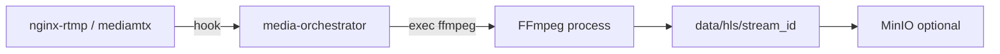
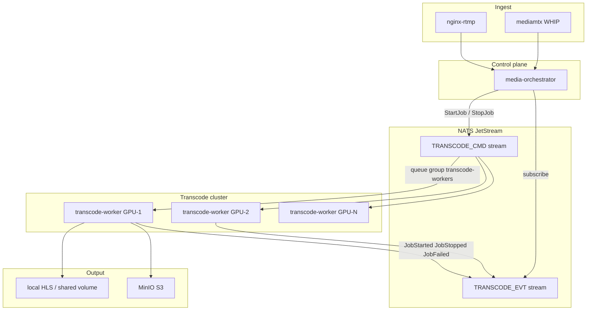

# Transcode-Worker — Faza 6/7 Implementatsiya Rejasi

> **Maqsad:** FFmpeg transcode'ni `media-orchestrator` dan ajratib, NATS JetStream orqali boshqariladigan `transcode-worker` cluster'ga ko'chirish.
>
> **Hozirgi holat:** `media-orchestrator/internal/pipeline/manager.go` har bir `OnPublish` da lokal FFmpeg ishga tushiradi.
>
> **Maqsad holat:** Orchestrator faqat job dispatch + lifecycle; FFmpeg faqat worker node'larda.

---

## Mundarija

1. [Arxitektura](#1-arxitektura)
2. [NATS JetStream dizayn](#2-nats-jetstream-dizayn)
3. [Job protokoli](#3-job-protokoli)
4. [Servis chegaralari](#4-servis-chegaralari)
5. [Faza 6 — Foundation](#5-faza-6--foundation)
6. [Faza 7 — Production scale](#6-faza-7--production-scale)
7. [Migratsiya strategiyasi](#7-migratsiya-strategiyasi)
8. [Fayl strukturasi](#8-fayl-strukturasi)
9. [Env o'zgaruvchilar](#9-env-ozgaruvchilar)
10. [Monitoring va alertlar](#10-monitoring-va-alertlar)
11. [Test rejasi](#11-test-rejasi)
12. [Vaqt bahosi](#12-vaqt-bahosi)

---

## 1. Arxitektura

### Hozir (embedded)



**Muammolar:** CPU/GPU bandligi, crash izolyatsiyasi yo'q, orchestrator bilan bir serverda scale qiyin.

### Maqsad (queue + worker)



---

## 2. NATS JetStream dizayn

### Stream'lar

| Stream | Subjects | Retention | Maqsad |
|--------|----------|-----------|--------|
| `TRANSCODE_CMD` | `transcode.cmd.start`, `transcode.cmd.stop` | WorkQueue | Orchestrator → worker buyruqlari |
| `TRANSCODE_EVT` | `transcode.evt.>` | Limits, 24h | Worker → orchestrator holat eventlari |

### Consumer

```text
Durable name:   transcode-workers
Queue group:    transcode-workers
Ack policy:     explicit (ManualAck)
Max deliver:    3
Ack wait:       30s
```

WorkQueue retention — har bir start job faqat bitta worker tomonidan qabul qilinadi (competing consumers).

### Subject konventsiyasi

```text
transcode.cmd.start          → StartJob payload
transcode.cmd.stop           → StopJob payload
transcode.evt.{stream_id}    → JobEvent payload (started | stopped | failed | heartbeat)
```

---

## 3. Job protokoli

### `pkg/transcode/job.go` (shared package)

```go
package transcode

type StartJob struct {
    JobID       string    `json:"job_id"`        // uuid
    StreamID    string    `json:"stream_id"`
    IngestName  string    `json:"ingest_name"`
    InputURL    string    `json:"input_url"`     // rtmp://... yoki rtsp://...
    OutputDir   string    `json:"output_dir"`    // absolute path yoki s3 prefix
    LatencyMode string    `json:"latency_mode"`  // ultra-low | standard
    Encoder     string    `json:"encoder"`       // libx264 | h264_nvenc
    Storage     string    `json:"storage"`       // local | s3
    Priority    int       `json:"priority"`      // live=10, vod=5
    IssuedAt    time.Time `json:"issued_at"`
}

type StopJob struct {
    JobID    string `json:"job_id"`
    StreamID string `json:"stream_id"`
    Reason   string `json:"reason"` // publish_done | admin | timeout
}

type JobEvent struct {
    JobID     string    `json:"job_id"`
    StreamID  string    `json:"stream_id"`
    Type      string    `json:"type"`      // started | stopped | failed | heartbeat
    WorkerID  string    `json:"worker_id"` // hostname/pod name
    FFmpegPID int       `json:"ffmpeg_pid,omitempty"`
    Error     string    `json:"error,omitempty"`
    At        time.Time `json:"at"`
}
```

### Mavjud kod qayta ishlatiladi

| Hozir | Keyin |
|-------|-------|
| `media-orchestrator/internal/transcode/*` | `pkg/transcode/*` ga ko'chiriladi (DRY) |
| `pipeline.FFmpegRunner` | `transcode-worker` ichida ishlatiladi |
| `sync/uploader.go` | worker ichida (S3 mode) |

---

## 4. Servis chegaralari

### `media-orchestrator` (o'zgaradi)

| Vazifa | Qoladi | Ketadi |
|--------|--------|--------|
| RTMP/WHIP hook qabul | ✅ | |
| Stream key validation | ✅ | |
| `stream_media` DB yozish | ✅ | |
| FFmpeg `exec` | | ❌ → NATS publish |
| Segment uploader | | ❌ → worker'da |

**Yangi:** `internal/dispatcher/nats.go` — `StartJob` / `StopJob` publish, `JobEvent` subscribe.

### `transcode-worker` (yangi servis)

| Vazifa |
|--------|
| NATS dan `StartJob` olish |
| FFmpeg ABR ishga tushirish (`pkg/transcode.Runner`) |
| `JobEvent` publish (started/stopped/failed) |
| 15s heartbeat (worker alive + pid) |
| `StopJob` da graceful FFmpeg stop |
| S3 segment sync (ixtiyoriy) |
| GPU capacity limit (max concurrent jobs) |
| `/health`, `/ready` (NATS + disk + GPU) |

### O'zgarmaydi

- `stream-service` — playback URL, signed delivery
- `api-gateway` — playback API
- Ingest (nginx-rtmp, mediamtx)

---

## 5. Faza 6 — Foundation

**Maqsad:** Dev muhitda queue mode ishlaydi; `TRANSCODE_MODE=local` default (orqaga mos).

### 6.1 Shared package (1–2 kun)

| # | Vazifa | Fayl |
|---|--------|------|
| 6.1.1 | `transcode` paketini `pkg/transcode/` ga ko'chirish | `ffmpeg.go`, `encoder.go`, `ladder.go`, `profile.go` |
| 6.1.2 | Job types | `pkg/transcode/job.go` |
| 6.1.3 | NATS bus | `pkg/nats/transcode.go` (`TranscodeBus`) |
| 6.1.4 | Unit test: job marshal, subject routing | `pkg/nats/transcode_test.go` |

### 6.2 transcode-worker servisi (2–3 kun)

| # | Vazifa | Fayl |
|---|--------|------|
| 6.2.1 | `services/transcode-worker/go.mod` | go.work ga qo'shish |
| 6.2.2 | `cmd/server/main.go` | NATS subscribe, health HTTP |
| 6.2.3 | `internal/worker/pool.go` | max concurrent, job map |
| 6.2.4 | `internal/worker/runner.go` | StartJob → FFmpeg, events |
| 6.2.5 | `internal/config/config.go` | env |
| 6.2.6 | Makefile, start-dev.sh, stop-services | port `9086` |

### 6.3 media-orchestrator dispatcher (1–2 kun)

| # | Vazifa | Fayl |
|---|--------|------|
| 6.3.1 | `TRANSCODE_MODE=local\|queue` | `config.go` |
| 6.3.2 | `TranscodeBackend` interface | `local.go` (hozirgi), `queue.go` (NATS) |
| 6.3.3 | `Manager` refactor — backend inject | `manager.go` |
| 6.3.4 | Event listener — DB `ffmpeg_pid` yangilash | `dispatcher/events.go` |

### 6.4 Integratsiya (1 kun)

| # | Vazifa |
|---|--------|
| 6.4.1 | `make smoke` — queue mode bilan live stream |
| 6.4.2 | Worker crash → job redelivery test |
| 6.4.3 | `scripts/test-transcode.sh` smoke |

**Faza 6 natijasi:** 1 orchestrator + 1–N worker, local dev, feature flag.

---

## 6. Faza 7 — Production scale

**Maqsad:** GPU cluster, K8s, monitoring, VOD.

### 7.1 GPU va capacity (2 kun)

| # | Vazifa |
|---|--------|
| 7.1.1 | `WORKER_MAX_JOBS` — NVENC: 8–12, CPU: 2–4 |
| 7.1.2 | GPU detection (`nvidia-smi` / `CUDA_VISIBLE_DEVICES`) |
| 7.1.3 | Job rad etish — worker to'lsa `JobEvent{Type:rejected}` |
| 7.1.4 | Priority queue — live job oldin |

### 7.2 Shared storage (2 kun)

| # | Vazifa |
|---|--------|
| 7.2.1 | Orchestrator va worker bir `HLS_OUTPUT_DIR` (NFS / EFS) |
| 7.2.2 | Yoki S3-only: worker to'g'ridan-to'g'ri MinIO ga yozadi |
| 7.2.3 | `stream-service` playback signed URL o'zgarmaydi |

### 7.3 Kubernetes (3–4 kun)

```yaml
# infra/k8s/transcode-worker/
deployment.yaml    # GPU nodeSelector, resources.limits.nvidia.com/gpu: 1
hpa.yaml           # custom metric: transcode_queue_depth
pdb.yaml           # minAvailable: 1
configmap.yaml     # encoder, ladder, NATS_URL
```

**HPA signallari:**

- `transcode_queue_depth` > 10 → scale up
- `worker_gpu_utilization` > 80% → scale up
- queue bo'sh 10 daqiqa → scale down (min 0 spot)

### 7.4 VOD transcode (3 kun)

| # | Vazifa |
|---|--------|
| 7.4.1 | `transcode.cmd.start` `priority=5`, `latency_mode=vod` |
| 7.4.2 | `OnPublishDone` → VOD finalize job (yuqori sifat, sekin preset) |
| 7.4.3 | `vod_recordings` jadvali bilan bog'lash |

### 7.5 Observability (1–2 kun)

| Metric | Tip |
|--------|-----|
| `transcode_jobs_active` | Gauge per worker |
| `transcode_queue_depth` | Gauge |
| `transcode_job_duration_sec` | Histogram |
| `transcode_job_failures_total` | Counter |
| `ffmpeg_process_running` | Gauge |

**Alertlar:**

- queue depth > 50 (5 daqiqa)
- failure rate > 5% (15 daqiqa)
- worker heartbeat yo'q (30s)

**Faza 7 natijasi:** Production GPU cluster, HPA, VOD, to'liq monitoring.

---

## 7. Migratsiya strategiyasi

### Feature flag

```env
# local = hozirgi (default, dev)
# queue = NATS orqali worker
TRANSCODE_MODE=local
```

### Bosqichlar

```text
1. pkg/transcode ko'chirish (orchestrator eski import'ni yangilaydi)
2. transcode-worker deploy (worker ishlaydi, lekin orchestrator hali local)
3. TRANSCODE_MODE=queue staging'da
4. Event sync tekshirish (pid, status)
5. Production: queue + 2+ GPU worker
6. local mode deprecated (Faza 7 oxirida olib tashlash)
```

### Rollback

`TRANSCODE_MODE=local` — orchestrator qayta lokal FFmpeg ishga tushiradi. Worker'lar bo'sh turadi.

---

## 8. Fayl strukturasi

```text
pkg/
  transcode/              # FFmpeg runner, ladder, profile, job types
    ffmpeg.go
    encoder.go
    ladder.go
    profile.go
    job.go
  nats/
    transcode.go          # TranscodeBus (cmd publish, evt subscribe)

services/
  transcode-worker/
    cmd/server/main.go
    internal/
      config/config.go
      worker/
        pool.go           # concurrent limit, active jobs
        runner.go         # StartJob handler
        heartbeat.go
      adapter/handler/http/health.go
    go.mod

  media-orchestrator/
    internal/
      pipeline/
        manager.go        # backend interface
      transcode/
        backend.go        # TranscodeBackend interface
        local_backend.go  # hozirgi FFmpeg
        queue_backend.go  # NATS dispatch
      dispatcher/
        events.go         # JobEvent → DB update
```

---

## 9. Env o'zgaruvchilar

### media-orchestrator

```env
TRANSCODE_MODE=local              # local | queue
NATS_URL=nats://localhost:4222
```

### transcode-worker

```env
WORKER_ID=transcode-worker-1      # hostname yoki pod name
WORKER_HTTP_ADDR=:9086
WORKER_MAX_JOBS=4                 # CPU: 2-4, GPU: 8-12
NATS_URL=nats://localhost:4222
FFMPEG_PATH=ffmpeg
FFMPEG_VIDEO_ENCODER=h264_nvenc   # GPU node
HLS_OUTPUT_DIR=./data/hls
HLS_STORAGE_BACKEND=local         # local | s3
# S3 (Faza 7)
MINIO_ENDPOINT=...
```

### Production

```env
TRANSCODE_MODE=queue
WORKER_MAX_JOBS=10
FFMPEG_VIDEO_ENCODER=h264_nvenc
HLS_STORAGE_BACKEND=s3
```

---

## 10. Monitoring va alertlar

### Health checks

| Servis | `/ready` tekshiruvi |
|--------|---------------------|
| transcode-worker | NATS ping, disk write, (GPU optional) |
| media-orchestrator | NATS ping, stream-service gRPC |

### Grafana dashboard (Faza 7)

- Active transcode jobs (worker bo'yicha)
- Queue depth vaqti bo'yicha
- O'rtacha job davomiyligi
- FFmpeg crash rate
- GPU utilization (DCGM)

---

## 11. Test rejasi

| Test | Qayerda |
|------|---------|
| Job JSON round-trip | `pkg/transcode/job_test.go` |
| NATS publish/consume | `pkg/nats/transcode_test.go` (miniredis emas — integration) |
| Start → HLS master.m3u8 mavjud | `scripts/test-transcode.sh` |
| Stop → FFmpeg process yo'q | shell + pgrep |
| Worker kill → job redelivery | manual / integration |
| Queue mode + playback smoke | `make smoke` kengaytma |

---

## 12. Vaqt bahosi

| Faza | Scope | Taxmin |
|------|-------|--------|
| **Faza 6** | pkg ko'chirish, worker, NATS, feature flag, dev smoke | **5–8 kun** |
| **Faza 7** | GPU, K8s HPA, S3 shared, VOD, monitoring | **10–14 kun** |
| **Jami** | Production-ready transcode cluster | **~3 hafta** |

---

## Keyingi qadam (tavsiya)

Faza 6 ni quyidagi tartibda boshlash:

1. `pkg/transcode` + `pkg/nats/transcode.go`
2. `services/transcode-worker` skeleton
3. `TRANSCODE_MODE=queue` orchestrator'da
4. `make smoke` queue mode bilan

Ruxsat bersangiz, **Faza 6.1** dan (shared package + NATS bus) implementatsiyani boshlaymiz.
